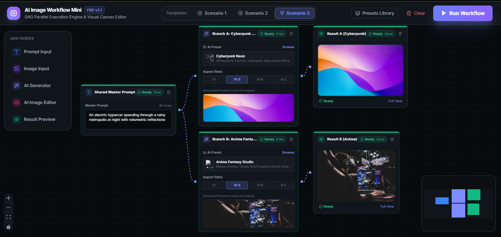
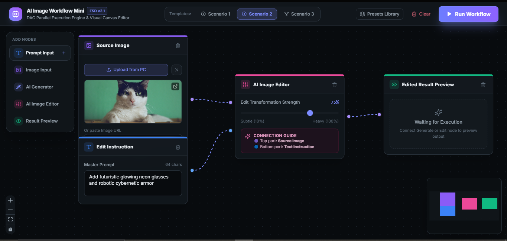
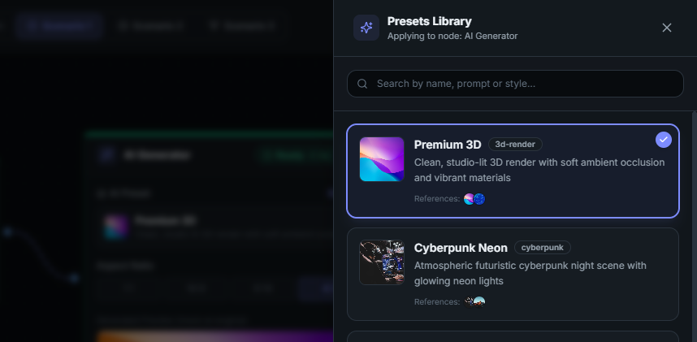
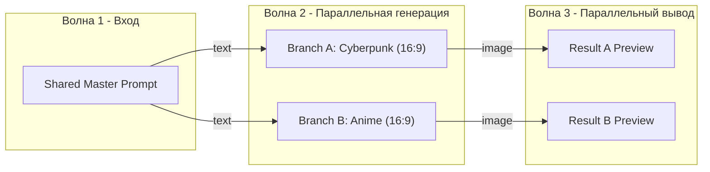

# AI Image Workflow Mini — Production Fullstack System

> **Fullstack AI Engineer Production System & Architectural Blueprint**  
> Полнофункциональный визуальный редактор рабочих процессов генерации и трансформации изображений на базе искусственного интеллекта. Построен на **React 18 + Feature-Sliced Design (FSD v2.1) + React Flow** на фронтенде и **NestJS + DAG Parallel Execution Engine (Kahn's Topological Waves) + Real-Time SSE** на бэкенде.
> 
🎬 [Demo video](https://drive.google.com/file/d/1KK7n1lT1GPrH0juw3mxqhZ6xkV5mDEfM/view?usp=sharing)
---

## 📑 Оглавление / Table of Contents

1. [Обзор проекта и ключевые сценарии](#-обзор-проекта-и-ключевые-сценарии)
2. [Обзор пользовательского интерфейса и экраны системы (UI Showcase)](#-обзор-пользовательского-интерфейса-и-экраны-системы-ui-showcase)
   - [Экран 1: Сценарий 3 — Параллельное ветвление и конкурентная генерация](#экран-1-сценарий-3--параллельное-ветвление-и-конкурентная-генерация)
   - [Экран 2: Сценарий 2 — Пайплайн редактирования и трансформации (Image-to-Image)](#экран-2-сценарий-2--пайплайн-редактирования-и-трансформации-image-to-image)
   - [Экран 3: Интерактивная библиотека AI-пресетов (Preset Drawer)](#экран-3-интерактивная-библиотека-ai-пресетов-preset-drawer)
3. [Архитектура и инженерные стандарты](#-архитектура-и-инженерные-стандарты)
   - [Frontend Architecture: Feature-Sliced Design (FSD v2.1)](#frontend-architecture-feature-sliced-design-fsd-v21)
   - [Backend Architecture: Strict NestJS Clean Modularity](#backend-architecture-strict-nestjs-clean-modularity)
4. [DAG Движок параллельного исполнения и волновой планировщик Кана](#-dag-движок-параллельного-исполнения-и-волновой-планировщик-кана)
5. [Smart Subtree Retry — Интеллектуальный точечный повтор](#-smart-subtree-retry--интеллектуальный-точечный-повтор)
6. [Гибридный AI-движок: Google Gemini & Neural Diffusion](#-гибридный-ai-движок-google-gemini--neural-diffusion)
7. [Система пресетов и AI Request Builder](#-система-пресетов-и-ai-request-builder)
8. [Типизация портов, Single-Input Constraint и защита от DoS](#-типизация-портов-single-input-constraint-и-защита-от-dos)
9. [Интерактивное управление связями на холсте (Custom Edges)](#-интерактивное-управление-связями-на-холсте-custom-edges)
10. [Спецификация API и Real-time SSE события](#-спецификация-api-и-real-time-sse-события)
11. [Безопасность и Enterprise-стандарты](#-безопасность-и-enterprise-стандарты)
12. [Быстрый старт и запуск](#-быстрый-старт-и-запуск)
13. [Верификация и автоматизированное тестирование](#-верификация-и-автоматизированное-тестирование)
14. [Архитектурные компромиссы (Trade-offs) & Roadmap улучшений](#-архитектурные-компромиссы-trade-offs--roadmap-улучшений)

- [1. Безопасность и контроль доступа (Security & Auth)](#1-безопасность-и-контроль-доступа-security--auth)
- [2. Персистентность и масштабируемость (Backend State & Scaling)](#2-персистентность-и-масштабируемость-backend-state--scaling)
- [3. Пользовательский опыт и интерактивность холста (UI/UX Canvas)](#3-пользовательский-опыт-и-интерактивность-холста-uiux-canvas)
- [4. Расширение AI-пайплайнов и логики нод (AI & Node Logic)](#4-расширение-ai-пайплайнов-и-логики-нод-ai--node-logic)
- [5. Наблюдаемость и мониторинг (Observability & Metrics)](#5-наблюдаемость-и-мониторинг-observability--metrics)

---

## 🎯 Обзор проекта и ключевые сценарии

**AI Image Workflow Mini** решает задачу гибкого оркестрирования сложных графов генерации и обработки медиа-контента с соблюдением строгих зависимостей, параллельного исполнения независимых ветвей и потоковой передачей статусов выполнения через Server-Sent Events (SSE).

### 🌟 3 встроенных 1-Click сценария:

#### Сценарий 1: Прямая генерация текста в изображение (Text-to-Image)

```
[ Prompt Node ] ──(text)──> [ Generate Image Node ] ──(image)──> [ Result Node ]
```

- Пользовательский текстовый промпт обогащается правилами выбранного пресета, отправляется в AI-шлюз и отображается в узле результата с временем выполнения и полноэкранным просмотром.

#### Сценарий 2: Трансформация и редактирование изображения (Image-to-Image / Inpainting)

```
[ Image Input Node ] ──(image)──┐
                                ├─> [ Edit Image Node ] ──(image)──> [ Result Node ]
[ Prompt Node ] ───────(text)───┘
```

- Принимает исходное изображение (загрузка с диска или URL) и инструкцию для редактирования, применяя трансформацию заданной силы (10%–100%).

#### Сценарий 3: Обязательное параллельное ветвление (Parallel Branching Execution)

```
                      ┌──(text)──> [ Generate Image A ] ──(image)──> [ Result A ]
[ Prompt Node ] ──────┤
                      └──(text)──> [ Generate Image B ] ──(image)──> [ Result B ]
```

- Единый мастер-промпт подается одновременно в два генератора с разными пресетами (например, **Cyberpunk Neon** и **Anime Fantasy**), которые **выполняются строго параллельно** в рамках одной топологической волны!

---

## 🖼 Обзор пользовательского интерфейса и экраны системы (UI Showcase)

Интерфейс спроектирован в современной темной неоновой теме с акцентом на эргономику, плавные микровзаимодействия и прозрачность статусов выполнения.

### Экран 1: Сценарий 3 — Параллельное ветвление и конкурентная генерация



#### Описание экрана и ключевых элементов:

- **Верхняя панель управления (Toolbar):**
  - Брендинг с индикацией архитектуры `[FSD v2.1]` и подзаголовком `DAG Parallel Execution Engine & Visual Canvas Editor`.
  - Переключатель шаблонов **Templates: 1-Click Scenarios** (активен `Scenario 3`).
  - Кнопка открытия библиотеки стилей **Presets Library**.
  - Кнопка быстрой очистки рабочей области **Clear**.
  - Основная кнопка запуска пайплайна **Run Workflow** с анимированным градиентом.
- **Левая плавающая палитра (Add Nodes Palette):**
  - Быстрый доступ для добавления узлов в один клик: `Prompt Input`, `Image Input`, `AI Generator`, `AI Image Editor`, `Result Preview`.
- **Холст графа (Visual Graph Canvas):**
  - Мастер-нода **Shared Master Prompt** с введенным описанием (_"An electric hypercar speeding through a rainy metropolis at night with volumetric reflections"_), индикатором готовности `Ready (1ms)` и счетчиком символов.
  - **Параллельные ветви Волна 2 (Wave 2):**
    - **Ветвь A:** `Branch A: Cyberpunk ...` (`Ready 1.5s`, пресет `Cyberpunk Neon`, соотношение сторон `16:9`, встроенное интерактивное превью).
    - **Ветвь B:** `Branch B: Anime Fantasy...` (`Ready 1.5s`, пресет `Anime Fantasy Studio`, соотношение сторон `16:9`, встроенное интерактивное превью).
  - **Узлы результатов Волна 3 (Wave 3):**
    - `Result A (Cyberpunk)` и `Result B (Anime)` с отображением финального артефакта, временем обработки и кнопкой полноэкранного просмотра `Full View`.
- **Интерактивная миникарта (Minimap):**
  - Расположена в правом нижнем углу, с цветовой кодировкой типов нод (синий — промпты, фиолетовый — генераторы, зеленый — результаты).
- **Панель зума и навигации (Canvas Controls):**
  - В левом нижнем углу: приближение (`+`), отдаление (`-`), центрирование (`Fit View`), блокировка холста.

---

### Экран 2: Сценарий 2 — Пайплайн редактирования и трансформации (Image-to-Image)



#### Описание экрана и ключевых элементов:

- **Узел источника изображения (Source Image Node):**
  - Кнопка прямой загрузки файла с ПК (`Upload from PC`), миниатюра предпросмотра выбранного изображения, возможность вставки прямого URL и кнопка открытия оригинала.
- **Узел текстовой инструкции (Edit Instruction Node):**
  - Поле ввода с промптом трансформации (_"Add futuristic glowing neon glasses and robotic cybernetic armor"_).
- **Узел редактирования (AI Image Editor Node):**
  - **Слайдер силы трансформации (Transformation Strength):** точная настройка от `Subtle (10%)` до `Heavy (100%)` (на скриншоте установлено `75%`).
  - **Встроенный гид по портам (Connection Guide):** наглядная цветовая шпаргалка (верхний фиолетовый порт — `Source Image`, нижний синий порт — `Text Instruction`).
- **Узел предпросмотра результата (Edited Result Preview Node):**
  - Находится в элегантном состоянии ожидания запуска (`Waiting for Execution`) с информативной подсказкой подключения.
- **Типизированные провода (Typed Bezier Edges):**
  - Фиолетовая линия передает бинарные данные/URL изображения (`image` port).
  - Синяя пунктирная линия передает текстовый контекст (`text` port).

---

### Экран 3: Интерактивная библиотека AI-пресетов (Preset Drawer)



#### Описание экрана и ключевых элементов:

- **Контекстная боковая шторка (Side Drawer):**
  - Плавно выезжает справа при клике на выбор пресета в ноде-генераторе с указанием целевого узла: `Applying to node: AI Generator`.
  - Эффект затемнения и размытия фона (Backdrop Blur) для концентрации внимания.
- **Живой поисковый фильтр:**
  - Строка поиска `Search by name, prompt or style...` для мгновенной фильтрации пресетов по названию, стилистике или ключевым словам промпта.
- **Интерактивные карточки пресетов:**
  - **Карточка `Premium 3D`:** бейдж тега `3d-render`, детальное описание световой схемы и материалов, круглые миниатюры референсов стиля, бейдж активного выбора (`✓`).
  - **Карточка `Cyberpunk Neon`:** бейдж тега `cyberpunk`, атмосферное описание неонового мегаполиса, превью референсов.
- **Мгновенное применение:** клик по карточке моментально перенастраивает стилистические модификаторы, негативный промпт и параметры сэмплирования выбранной ноды.

---

## 🏗 Архитектура и инженерные стандарты

Проект спроектирован по принципам **Clean Architecture**, **SOLID** и строгой модульности.

```
Snapbuild-test/
├── Frontend/                      # React 18 + Vite + Tailwind + FSD v2.1
├── backend/                       # NestJS 10 + RxJS + TypeScript Strict
├── docs/                          # Пошаговая документация архитектурных фаз (00-07)
├── graphify-out/                  # Интерактивный граф знаний кодовой базы (870 узлов, 36 сообществ)
└── docker-compose.yml             # Мультиконтейнерная оркестрация
```

### Frontend Architecture: Feature-Sliced Design (FSD v2.1)

Фронтенд строго соблюдает направленный поток зависимостей FSD: импорты разрешены только сверху вниз (`app` → `pages` → `widgets` → `features` → `entities` → `shared`).

```
Frontend/src/
├── app/                          # Инициализация приложения, провайдеры, глобальные стили
│   ├── providers/                # Обертка контекстов (Query, Toast, Flow)
│   ├── App.tsx                   # Корневой компонент
│   └── main.tsx                  # Точка входа Vite
│
├── pages/                        # Композиция страниц
│   └── workflow-editor/          # Основная страница редактора холста
│       ├── ui/workflow-editor-page.tsx
│       └── index.ts
│
├── widgets/                      # Самостоятельные крупные блоки интерфейса
│   ├── workflow-canvas/          # Холст React Flow, обработка перетаскивания и реконнекта
│   ├── canvas-toolbar/           # Верхняя панель управления (пресеты, сценарии, запуск)
│   ├── canvas-node-palette/      # Плавающая палитра добавления новых нод
│   ├── preset-drawer/            # Боковая шторка выбора AI-пресетов
│   └── node-inspector/           # Панель детальной инспекции выбранного узла
│
├── features/                     # Пользовательские сценарии и бизнес-фичи
│   ├── execute-workflow/         # Запуск DAG-графа и SSE-подписка на стрим событий
│   ├── retry-node/               # Точечный перезапуск упавшей ноды и ее потомков
│   ├── connect-ports/            # Валидация совместимости типов портов (text vs image)
│   └── workflow-templates/       # Загрузчик 1-Click тестовых сценариев
│
├── entities/                     # Бизнес-сущности и кастомные React Flow компоненты
│   ├── node/                     # Доменные представления нод холста:
│   │   ├── ui/base-node.tsx      # Универсальная карточка ноды с тулбаром и статусом
│   │   ├── ui/custom-edge.tsx    # Кастомная связь с кнопкой быстрого удаления [×]
│   │   ├── ui/prompt-node.tsx    # Узел текстового промпта
│   │   ├── ui/image-input-node.tsx # Узел загрузки и превью изображения
│   │   ├── ui/generate-image-node.tsx # Узел AI генератора
│   │   ├── ui/edit-image-node.tsx # Узел AI редактора
│   │   ├── ui/result-node.tsx    # Узел финального результата
│   │   ├── lib/node-connection-helpers.ts # Логика Single-Input замены соединений
│   │   ├── lib/node-retry-service.ts      # Клиент изолированного перезапуска
│   │   ├── model/use-workflow-store.ts    # Центральный Zustand-стор состояния графа
│   │   └── index.ts
│   ├── preset/                   # Модели пресетов, дефолтные пресеты, API клиент
│   └── run/                      # Модели запусков, бейджи статусов, API клиент
│
└── shared/                       # Переиспользуемые утилиты без бизнес-логики
    ├── api/                      # Axios клиент, типизированный EventSource/SSE
    ├── config/                   # Схемы нод, типы портов, лимиты холста
    ├── lib/                      # Валидаторы графа, утилита cn (clsx + tailwind-merge)
    ├── types/                    # Глобальные TypeScript интерфейсы
    └── ui/                       # UI-Kit (Button, Badge, Card, Modal, Slider, Toast)
```

---

### Backend Architecture: Strict NestJS Clean Modularity

Бэкенд следует принципам чистой слоистой архитектуры (Domain, Application, Infrastructure) с разделением ответственности и гексагональными портами для провайдеров.

```
backend/src/
├── main.ts                       # Бутстрап NestJS: StrictValidationPipe, CORS, Swagger
├── app.module.ts                 # Корневой DI-контейнер и автопоиск .env файлов
│
├── core/                         # Общесистемная инфраструктура
│   ├── config/                   # Типизированная конфигурация окружения с санитайзингом
│   ├── filters/                  # AllExceptionsFilter & HttpExceptionFilter
│   ├── interceptors/             # LoggingInterceptor & TransformInterceptor
│   ├── pipes/                    # StrictValidationPipe (whitelisting & error formatting)
│   └── swagger/                  # Конфигурация OpenAPI / Swagger
│
├── common/                       # Общие контракты и DTO
│   ├── interfaces/api-response.interface.ts
│   └── utils/id-generator.util.ts
│
└── modules/                      # Изолированные доменные модули
    ├── presets/                  # Библиотека и хранилище AI-пресетов
    │   ├── domain/preset.entity.ts
    │   ├── dto/preset.dto.ts
    │   ├── services/presets.service.ts
    │   └── controllers/presets.controller.ts
    │
    ├── ai/                       # AI Gateway & Hexagonal Provider Adapters
    │   ├── domain/prompt-builder.ts          # Сборка промптов с учетом пресетов
    │   ├── ports/ai-provider.interface.ts     # Гексагональный интерфейс AI-провайдера
    │   ├── adapters/google-gemini.adapter.ts # Gemini 3.6 Flash + Flux Diffusion рендерер
    │   ├── adapters/diffusion-renderer.util.ts # Генерация растровых изображений в Data URI
    │   ├── adapters/mock-ai.adapter.ts        # Высокоточный оффлайн AI-генератор
    │   ├── adapters/openai-dalle.adapter.ts   # DALL-E 3 адаптер
    │   ├── adapters/stability-ai.adapter.ts   # Stability AI SDXL адаптер
    │   ├── adapters/replicate.adapter.ts      # Replicate Flux адаптер
    │   └── services/ai-gateway.service.ts     # Автодетекция ключей и роутинг провайдеров
    │
    ├── workflows/                # Спецификация графа, лимиты и валидация
    │   ├── domain/port-type.enum.ts           # Типы портов: 'text' | 'image'
    │   ├── domain/workflow-limits.constants.ts # Защита от DoS (макс. 30 нод, 60 связей)
    │   ├── domain/workflow.entity.ts
    │   ├── dto/validate-graph.dto.ts
    │   ├── services/graph-validator.service.ts # Проверка циклов, портов и single-input
    │   └── controllers/workflows.controller.ts
    │
    └── runs/                     # Движок выполнения, планировщик и SSE
        ├── domain/run.entity.ts
        ├── domain/node-job.entity.ts          # idle | queued | running | success | error
        ├── engine/dag-scheduler.ts            # Планировщик волн Кана и Subtree Resolver
        ├── engine/node-executor.ts            # Типизированный исполнитель конкретной ноды
        ├── services/run-events.service.ts     # RxJS Subject SSE-стриминг и очистка истории
        ├── services/graph-execution.engine.ts # Параллельный волновой раннер (Promise.allSettled)
        ├── services/runs.service.ts           # Оркестратор пайплайнов и Smart Retry
        └── controllers/runs.controller.ts     # POST /runs, GET /runs/:id/events, POST /retry
```

---

## ⚡ DAG Движок параллельного исполнения и волновой планировщик Кана

1. **Детекция циклов и топологическая сортировка:**
   - Алгоритм Кана вычисляет степени входа (in-degree) всех вершин графа и гарантирует, что граф является направленным ациклическим (DAG). При наличии цикла возвращается ошибка с трассировкой проблемных узлов.
2. **Топологические волны (Execution Waves):**
   - Все узлы группируются в уровни/волны $W_0, W_1, \dots, W_k$, где узлы волны $W_n$ зависят исключительно от результатов предыдущих волн $< n$.
3. **Параллельное конкурентное выполнение:**
   - Независимые ветви (например, генераторы A и B в Сценарии 3) помещаются в одну волну и запускаются **одновременно** с помощью `Promise.allSettled()`.
4. **Автоматическая маршрутизация данных:**
   - Выходные данные родительской ноды (`sourceHandle`) автоматически доставляются в соответствующий входной порт дочерней ноды (`targetHandle`).



---

## 🔄 Smart Subtree Retry — Интеллектуальный точечный повтор

Если выполнение какой-либо ноды завершается ошибкой (или пользователь изменил параметры отдельного узла), движок поддерживает изолированный точечный перезапуск:

- **Алгоритм `DagScheduler.resolveRetryNodeIds`:**
  1. Вычисляет множество зависимых дочерних узлов (Downstream Subtree) через рекурсивный BFS/DFS.
  2. Проверяет готовность родительских узлов (Upstream Dependencies). Если родительские данные уже вычислены (`SUCCESS`), они **не пересчитываются повторно**!
  3. Формирует минимальное поддерево для перерасчета.
- **Синхронизация данных на лету (`allNodesData`):**
  - Пользователь может скорректировать промпт или параметры прямо перед нажатием **Retry** — обновленные данные передаются на бэкенд и применяются к повторному запуску.
- **Очистка устаревших SSE событий:**
  - Метод `runEventsService.resetHistoryForRetry` очищает устаревшие события ошибки для перезапускаемых нод, предотвращая рассинхронизацию интерфейса.

---

## 🧠 Гибридный AI-движок: Google Gemini & Neural Diffusion

Система поддерживает как реальные провайдеры искусственного интеллекта, так и полностью автономный оффлайн-режим:

1. **Двухэтапный конвейер генерации (Real AI Pipeline):**
   - **Этап 1: LLM Prompt Refining (Google Gemini 3.6 Flash):** Быстрый промпт-инжиниринг через `gemini-3.6-flash:generateContent` (обогащение промпта стилистическими атрибутами, ракурсом, светом и правилами пресетов за 1–2 сек с лимитом 8 сек).
   - **Этап 2: Neural Diffusion Rendering (Flux.1 / SDXL):** Высокоскоростной нейросетевой рендеринг реальных растровых изображений в Data URI (`data:image/jpeg;base64,...`) с автоматическим определением соотношения сторон (1:1, 16:9, 9:16, 4:3).
2. **Мгновенный отказоустойчивый Fallback:**
   - При сетевых таймаутах, отсутствии API-ключей или квотовых ограничениях (`503 High Demand`) система плавно переключается на `MockAiAdapter`, гарантируя бесперебойную работу интерфейса.
3. **Имитация ошибок для тестирования ретрая:**
   - Включение токена `#fail` в текст любого промпта намеренно вызывает ошибку `AI_PROVIDER_ERROR` для проверки работы кнопки **Retry** и UI-статусов ошибок.

---

## 🎨 Система пресетов и AI Request Builder

Пресеты представляют собой структурированные конфигурации стилей:

```json
{
  "id": "preset-cyberpunk-neon",
  "name": "Cyberpunk Neon",
  "description": "Atmospheric futuristic cyberpunk night scene with glowing neon lights",
  "mainPrompt": "cyberpunk aesthetic, rainy night city, intense neon reflections, ray tracing, unreal engine 5 render, cinematic lighting",
  "negativePrompt": "daylight, sunshine, oversaturated pastel, cartoon, blurry, low resolution",
  "references": ["https://images.unsplash.com/photo-1542751371-adc38448a05e?w=600"],
  "defaultParams": {
    "aspectRatio": "16:9",
    "style": "cyberpunk",
    "cfgScale": 8.0,
    "steps": 35
  }
}
```

### Формула сборки запроса (Prompt Request Builder):

$$\text{Final Prompt} = \text{User Prompt} + \text{Preset.mainPrompt}$$
$$\text{Negative Prompt} = \text{Preset.negativePrompt}$$
$$\text{References} = \text{Preset.references} \cup \text{Node Image Inputs}$$

---

## 🔒 Типизация портов, Single-Input Constraint и защита от DoS

### Матрица валидации соединений:

| Выходной порт источника    | Входной порт приемника    |        Статус        | Обоснование                                   |
| :------------------------- | :------------------------ | :------------------: | :-------------------------------------------- |
| `text` (`Prompt Node`)     | `text` (`Generate Image`) |     ✅ Разрешено     | Передача текстового промпта                   |
| `image` (`Image Input`)    | `image` (`Edit Image`)    |     ✅ Разрешено     | Передача исходного изображения                |
| `text` (`Prompt Node`)     | `text` (`Edit Image`)     |     ✅ Разрешено     | Передача инструкции редактирования            |
| `image` (`Generate Image`) | `image` (`Result Node`)   |     ✅ Разрешено     | Передача сгенерированного артефакта           |
| `image` (`Image Input`)    | `text` (`Generate Image`) | ❌ **Заблокировано** | Несовместимость типов (`image` $\neq$ `text`) |
| `text` (`Prompt Node`)     | `image` (`Result Node`)   | ❌ **Заблокировано** | Несовместимость типов (`text` $\neq$ `image`) |

### Правило Single-Input Constraint:

- Каждый входной порт ноды может принимать **только одну входящую связь**. При попытке подключить новый провод к уже занятому порту старая связь автоматически замещается новой (`node-connection-helpers.ts`).

### Защита от DoS (Workflow Limits):

- Константы `WORKFLOW_LIMITS` и декораторы `@ArrayMaxSize` на бэкенде:
  - Максимум **30 узлов** в одном пайплайне.
  - Максимум **60 соединений (ребер)**.
  - Максимум **10 AI-генераторов** на один запуск.

---

## 🔌 Интерактивное управление связями на холсте (Custom Edges)

- **Компонент `CustomWorkflowEdge`:**
  - Увеличенный хитбокс толщиной **28px** для удобного наведения курсора.
  - Неоновая подсветка и кнопка быстрого удаления `[×]` прямо на середине кривой Безье.
  - Интерактивное переподключение проводов: перетаскивание конца связи на другой совместимый порт или в пустое пространство для быстрого отключения (`onReconnectEnd`).

---

## 📡 Спецификация API и Real-time SSE события

Интерактивная документация Swagger/OpenAPI доступна по адресу: `http://localhost:4000/api/docs`.

### Основные эндпоинты:

- `POST /api/v1/runs` — Отправка графа на асинхронное выполнение. Возвращает `{ runId, status, executionWaves }`.
- `GET /api/v1/runs/:runId` — Получение полного слепка запуска со статусами всех нод (`idle`, `queued`, `running`, `success`, `error`).
- `GET /api/v1/runs/:runId/events` — **Server-Sent Events (SSE)** поток для получения обновлений статусов нод и результатов в реальном времени (поддерживает фильтрацию `since`).
- `POST /api/v1/runs/:runId/retry/:nodeId` — Точечный повторный запуск упавшей ноды и ее зависимых потомков.
- `POST /api/v1/workflows/validate` — Валидация структуры графа, портов и лимитов сложности перед запуском.
- `GET /api/v1/presets` — Получение каталога доступных AI-пресетов.

---

## 🛡 Безопасность и Enterprise-стандарты

1. **Zero Client-Side API Keys:** Секретные ключи (`GEMINI_API_KEY`, `OPENAI_API_KEY`, `STABILITY_API_KEY`) хранятся исключительно на сервере NestJS и никогда не утекают в браузер.
2. **Санитайзинг переменных окружения:** Автоматическая очистка ключей от кавычек и пробелов (`sanitizeKey`).
3. **Строгая валидация входных данных:** `StrictValidationPipe` с белым списком полей (`whitelist: true, forbidNonWhitelisted: true`) блокирует посторонние payload-атаки.
4. **Toast-система уведомлений:** Мгновенное информирование пользователя об ошибках валидации, сетевых сбоях и успешных запусках.

---

## 🚀 Быстрый старт и запуск

### Требования к окружению:

- Node.js >= 18 (протестировано на Node.js 20 и 24)
- npm >= 9

### Вариант 1: Локальный запуск через npm

```bash
# 1. Установка зависимостей (root, backend, Frontend)
npm run install:all

# 2. Запуск бэкенда и фронтенда в параллельном режиме
npm run dev
```

- **Frontend:** `http://localhost:5173`
- **Backend API:** `http://localhost:4000/api/v1`
- **Swagger OpenAPI:** `http://localhost:4000/api/docs`

### Вариант 2: Запуск в Docker Compose

```bash
docker-compose up --build
```

---

## 🧪 Верификация и автоматизированное тестирование

Запуск полного набора unit-тестов бэкенда:

```bash
npm run test:backend
```

### Результаты автоматических тестов:

```text
 PASS  src/modules/ai/domain/prompt-builder.spec.ts
 PASS  src/modules/runs/engine/dag-scheduler.spec.ts
 PASS  src/modules/workflows/services/graph-validator.service.spec.ts

Test Suites: 3 passed, 3 total
Tests:       12 passed, 12 total
Snapshots:   0 total
Time:        ~15 s
Ran all test suites.
```

### Покрытие ключевых модулей:

- `dag-scheduler.spec.ts`: Проверка волновой группировки Кана, параллелизма и алгоритма `resolveRetryNodeIds` для изолированного ретрая поддеревьев.
- `graph-validator.service.spec.ts`: Проверка линейных и разветвленных пайплайнов, детекция циклов, валидация портов и лимитов графа.
- `prompt-builder.spec.ts`: Проверка слияния промптов с правилами пресетов и дефолтных параметров.

---

## ⚖️ Архитектурные компромиссы (Trade-offs) & Roadmap улучшений

В текущей версии системы реализованы осознанные инженерные компромиссы для обеспечения высокой скорости работы, простоты локального развертывания и надежности без тяжелых внешних зависимостей. Ниже представлены ключевые векторы развития для перехода в production-ready enterprise систему:

### 1. Безопасность и контроль доступа (Security & Auth)

- **Текущий компромисс:** Открытый API без авторизации, защита от DoS только на уровне лимитов DTO (`WORKFLOW_LIMITS`).
- **Что улучшить:**
  - **Аутентификация & RBAC:** Внедрение JWT / OAuth2 (Supabase Auth / Auth0) с ролевой моделью (`User`, `Creator`, `Admin`).
  - **Rate Limiting & Anti-Abuse:** Настройка `@nestjs/throttler` (RPS/RPM лимиты на IP и User ID для защиты от расхода AI-квот).
  - **Глубокая валидация медиа:** Проверка сигнатур файлов (Magic Bytes) и серверное сканирование загружаемых изображений на вредоносный код (ClamAV / AWS Rekognition) вместо доверия клиентским Data URI.

### 2. Персистентность и масштабируемость (Backend State & Scaling)

- **Текущий компромисс:** Состояние запусков (`runs`) и SSE-стримы хранятся In-Memory (`Map` / RxJS Subjects). При рестарте сервера состояние теряется.
- **Что улучшить:**
  - **Распределенная очередь задач:** Вынос тяжелых генераций в **Redis + BullMQ** с поддержкой приоритизации, graceful shutdown и автоматических повторов (Exponential Backoff).
  - **База данных и персистентность:** Сохранение графов, версий пайплайнов и истории генераций в **PostgreSQL / Supabase (Prisma ORM)**.
  - **Масштабирование Real-Time событий:** Использование Redis Pub/Sub или WebSocket Gateway для синхронизации SSE-событий между кластерами бэкенда.

### 3. Пользовательский опыт и интерактивность холста (UI/UX Canvas)

- **Текущий компромисс:** Одиночное выделение нод, базовая история состояний без глубокого стека отмены.
- **Что улучшить:**
  - **История действий (Undo / Redo):** Подключение темпорального стора Zustand (`zundo`) для отмены перемещений нод, связей и удалений.
  - **Горячие клавиши и мультивыделение:** Поддержка `Ctrl+Z`, `Ctrl+Y`, `Ctrl+C / Ctrl+V`, групповое выделение рамкой (Box Selection) и копирование веток графа.
  - **Экспорт / Импорт пайплайнов:** Возможность сохранения и загрузки графов в JSON-файлы, а также обмен шаблонами по ссылке.
  - **Стриминг прогресса генерации:** Отображение процента прогресса (0% → 100%) и промежуточных денойзинг-шагов диффузии прямо в карточке ноды.

### 4. Расширение AI-пайплайнов и логики нод (AI & Node Logic)

- **Текущий компромисс:** Фиксированные типы нод (Prompt, Image Input, Generator, Editor, Result) и линейная передача данных.
- **Что улучшить:**
  - **Пользовательские провайдеры (BYOK):** Подключение пользовательских API-ключей и эндпоинтов (OpenRouter, Ollama, HuggingFace, Runware).
  - **Новые типы узлов:**
    - `Condition / Router Node` — условное ветвление (If/Else по качеству, тегам или длине промпта).
    - `Image Blend / Compose Node` — объединение нескольких изображений (маски, слои, наложение).
    - `Upscale & Face Restore Node` — апскейлинг (Real-ESRGAN) и коррекция лиц (GFPGAN).
    - `LLM Vision Evaluator Node` — автоматическая оценка качества сгенерированного артефакта через мультимодальную LLM.

### 5. Наблюдаемость и мониторинг (Observability & Metrics)

- **Текущий компромисс:** Консольное логирование через `LoggingInterceptor`.
- **Что улучшить:**
  - **Сбор метрик:** Интеграция OpenTelemetry / Prometheus для отслеживания латентности AI-провайдеров, времени нахождения задач в очереди и нагрузки на волновой планировщик.
  - **Трассировка ошибок:** Подключение Sentry для быстрого обнаружения сбоев внешних API и ошибок сериализации графа.
