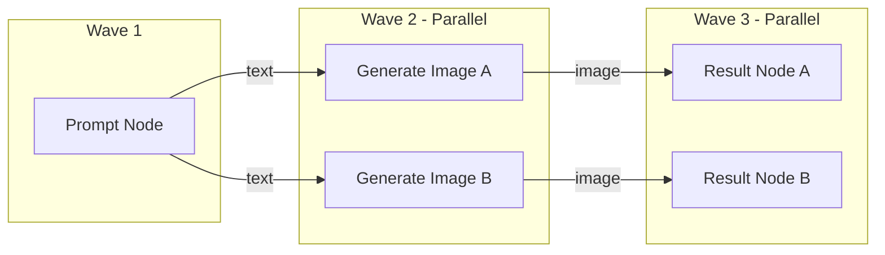

# AI Image Workflow Mini — Production Fullstack System

> **Fullstack AI Engineer Test Assignment & Architectural Blueprint**  
> Built with **React 18 + Feature-Sliced Design (FSD v2.1) + React Flow** on the Frontend and **Strict Nest.js + DAG Parallel Execution Engine + SSE Streaming** on the Backend.

---

## 📑 Table of Contents
1. [Project Overview & Supported Scenarios](#-project-overview--supported-scenarios)
2. [Architecture & Design Principles](#-architecture--design-principles)
   - [Frontend Architecture: Feature-Sliced Design (FSD v2.1)](#frontend-architecture-feature-sliced-design-fsd-v21)
   - [Backend Architecture: Strict NestJS Clean Modularity](#backend-architecture-strict-nestjs-clean-modularity)
3. [DAG Parallel Execution Engine & Topological Waves](#-dag-parallel-execution-engine--topological-waves)
4. [Preset System & AI Request Builder](#-preset-system--ai-request-builder)
5. [Typed Port Validation Matrix](#-typed-port-validation-matrix)
6. [API Specifications & Real-time SSE Events](#-api-specifications--real-time-sse-events)
7. [Security & Enterprise Standards](#-security--enterprise-standards)
8. [Quick Start & Launch Guide](#-quick-start--launch-guide)
9. [Verification & Automated Tests](#-verification--automated-tests)

---

## 🎯 Project Overview & Supported Scenarios

This project is a high-performance, node-based visual workflow editor for AI image generation and transformation pipelines. It solves complex graph dependencies with asynchronous parallel execution, typed port validation, and real-time Server-Sent Events (SSE) updates.

### 🌟 3 Built-in Scenarios (One-Click Templates)

#### Scenario 1: Text to Image Pipeline
```
[ Prompt Node ] ──(text)──> [ Generate Image Node ] ──(image)──> [ Result Node ]
```
- Accepts text input, combines it with the selected Preset rules, calls AI generation provider, and streams the preview to the Result node.

#### Scenario 2: Image Edit & Inpaint Pipeline
```
[ Image Input Node ] ──(image)──┐
                                ├─> [ Edit Image Node ] ──(image)──> [ Result Node ]
[ Prompt Node ] ───────(text)───┘
```
- Takes a source image URL and an instruction prompt to perform image transformation / style transfer with configurable strength.

#### Scenario 3: Mandatory Parallel Branching
```
                      ┌──(text)──> [ Generate Image A ] ──(image)──> [ Result A ]
[ Prompt Node ] ──────┤
                      └──(text)──> [ Generate Image B ] ──(image)──> [ Result B ]
```
- A single prompt feeds into two different AI generators (e.g. **Branch A: Cyberpunk Neon** and **Branch B: Anime Fantasy**), which **execute concurrently in parallel** in the same scheduling wave!

---

## 🏗 Architecture & Design Principles

### Frontend Architecture: Feature-Sliced Design (FSD v2.1)

The frontend is structured in strict accordance with **Feature-Sliced Design (FSD)** guidelines. Imports can only flow downwards: `app` → `pages` → `widgets` → `features` → `entities` → `shared`.

```
Frontend/src/
├── app/                          # Top-level setup, providers, styles, entry
│   ├── providers/                # React context providers wrapper
│   ├── App.tsx                   # Root component
│   └── main.tsx                  # Application bootstrap
│
├── pages/                        # Composed views and routing entry points
│   └── workflow-editor/          # Main visual canvas workspace view
│       ├── ui/workflow-editor-page.tsx
│       └── index.ts
│
├── widgets/                      # Composite, standalone UI sections
│   ├── workflow-canvas/          # Interactive React Flow Canvas + minimap + controls
│   ├── canvas-toolbar/           # Top bar (branding, templates switcher, run trigger)
│   ├── canvas-node-palette/      # Floating node insertion palette
│   ├── preset-drawer/            # Side-drawer for browsing & applying AI presets
│   └── node-inspector/           # Property panel for selected node inspection
│
├── features/                     # User scenarios and business use-cases
│   ├── execute-workflow/         # Runs DAG pipeline & manages SSE subscription stream
│   ├── retry-node/               # Retries a failed node and its downstream subtree
│   ├── connect-ports/            # Validates connection compatibility (text vs image)
│   └── workflow-templates/       # Predefined 1-click test scenarios loader
│
├── entities/                     # Business domain representations & custom UI cards
│   ├── node/                     # Custom React Flow Node representations:
│   │   ├── ui/prompt-node.tsx
│   │   ├── ui/image-input-node.tsx
│   │   ├── ui/generate-image-node.tsx
│   │   ├── ui/edit-image-node.tsx
│   │   ├── ui/result-node.tsx
│   │   ├── model/use-workflow-store.ts  # Zustand store for canvas graph state
│   │   └── index.ts
│   ├── preset/                   # Preset card, models, API client
│   └── run/                      # Execution snapshot, badges, API client
│
└── shared/                       # Reusable primitives, agnostic to domain
    ├── api/                      # Axios client & typed SSE event listener
    ├── config/                   # Node schemas, port configurations, constants
    ├── lib/                      # DAG utilities, port-validator, clsx helper
    ├── types/                    # Global TypeScript contracts
    └── ui/                       # Reusable UI kit (Button, Badge, Card, Modal, Input, etc.)
```

---

### Backend Architecture: Strict NestJS Clean Modularity

The backend adheres to Clean Architecture and strict NestJS modular boundaries with typed DTO validation and separation of domain, application, and infrastructure layers.

```
backend/src/
├── main.ts                       # Bootstraps NestJS with ValidationPipe, CORS, Swagger
├── app.module.ts                 # Root dependency injection container
│
├── core/                         # Cross-cutting enterprise infrastructure
│   ├── config/                   # Typed environment schema & configuration
│   ├── filters/                  # AllExceptionsFilter & HttpExceptionFilter
│   ├── interceptors/             # LoggingInterceptor & TransformInterceptor
│   ├── pipes/                    # StrictValidationPipe (whitelisting & error formatting)
│   └── swagger/                  # OpenAPI / Swagger specification setup
│
├── common/                       # Shared contracts & utilities
│   ├── interfaces/api-response.interface.ts
│   └── utils/id-generator.util.ts
│
└── modules/                      # Isolated domain feature modules
    ├── presets/                  # Curated Preset library & custom preset storage
    │   ├── domain/preset.entity.ts
    │   ├── dto/preset.dto.ts
    │   ├── services/presets.service.ts
    │   └── controllers/presets.controller.ts
    │
    ├── ai/                       # AI Gateway & Provider Adapters
    │   ├── domain/prompt-builder.ts          # Preset + User Prompt Request Builder
    │   ├── ports/ai-provider.interface.ts     # Hexagonal provider port
    │   ├── adapters/mock-ai.adapter.ts        # Fast, offline thematic AI generator
    │   ├── adapters/openai-dalle.adapter.ts   # OpenAI DALL-E 3 integration
    │   ├── adapters/stability-ai.adapter.ts   # Stability AI SDXL integration
    │   ├── adapters/replicate.adapter.ts      # Replicate Flux integration
    │   └── services/ai-gateway.service.ts     # Provider routing & fallback logic
    │
    ├── workflows/                # Graph definition, DAG validation & templates
    │   ├── domain/port-type.enum.ts           # 'text' | 'image' & node schemas
    │   ├── domain/workflow.entity.ts
    │   ├── dto/validate-graph.dto.ts
    │   ├── services/graph-validator.service.ts # Cycle detection & port typing
    │   └── controllers/workflows.controller.ts
    │
    └── runs/                     # Execution Engine, Job Scheduling & Parallel Runner
        ├── domain/run.entity.ts
        ├── domain/node-job.entity.ts          # 'idle' | 'queued' | 'running' | 'success' | 'error'
        ├── engine/dag-scheduler.ts            # Kahn's topological wave scheduler
        ├── engine/node-executor.ts            # Typed node execution handler
        ├── services/run-events.service.ts     # RxJS Subject SSE streaming
        ├── services/graph-execution.engine.ts # Parallel wave runner (Promise.all)
        ├── services/runs.service.ts           # Asynchronous execution & retry orchestrator
        └── controllers/runs.controller.ts     # POST /runs, GET /runs/:id/events (SSE)
```

---

## ⚡ DAG Parallel Execution Engine & Topological Waves

1. **Cycle Detection & Topological Sort**: Uses Kahn's algorithm to ensure the graph is a Directed Acyclic Graph (DAG).
2. **Execution Waves**: Nodes are grouped into level batches where all nodes in Wave $N$ only depend on outputs from Waves $< N$.
3. **Parallelism**: Sibling branches (e.g. `Generate Image A` and `Generate Image B`) reside in the same wave and execute **concurrently** using `Promise.allSettled()`.
4. **Data Piping**: Upstream node outputs (`sourceHandle`) are automatically mapped and delivered to downstream inputs (`targetHandle`).
5. **Subtree Retry**: If a node fails, the user can click **"Retry"** on that specific node. The engine calculates the transitive closure of downstream dependent nodes, resets only that affected subtree, and re-executes it without re-running unaffected parent branches!



---

## 🎨 Preset System & AI Request Builder

The Preset model is a first-class citizen in the data layer:
```json
{
  "id": "preset-cyberpunk-neon",
  "name": "Cyberpunk Neon",
  "description": "Atmospheric futuristic cyberpunk night scene with glowing neon lights",
  "mainPrompt": "cyberpunk aesthetic, rainy night city, intense neon reflections...",
  "negativePrompt": "daylight, sunshine, oversaturated pastel, cartoon, blurry...",
  "references": [
    "https://images.unsplash.com/photo-1542751371-adc38448a05e?w=600"
  ],
  "defaultParams": {
    "aspectRatio": "16:9",
    "style": "cyberpunk",
    "cfgScale": 8.0,
    "steps": 35
  }
}
```

### Request Builder Formula:
$$\text{Final Prompt} = \text{User Prompt} + \text{Preset.mainPrompt}$$
$$\text{Negative Prompt} = \text{Preset.negativePrompt}$$
$$\text{References} = \text{Preset.references} \cup \text{Node Image Inputs}$$

---

## 🔒 Typed Port Validation Matrix

The canvas and backend validate port connections to prevent invalid pipeline combinations:

| Source Output Port | Target Input Port | Status | Reason |
|---|---|---|---|
| `text` (`Prompt`) | `text` (`Generate Image`) | ✅ Allowed | Text prompt forwarding |
| `image` (`Image Input`) | `image` (`Edit Image`) | ✅ Allowed | Source image forwarding |
| `text` (`Prompt`) | `text` (`Edit Image`) | ✅ Allowed | Edit instruction prompt |
| `image` (`Generate Image`) | `image` (`Result`) | ✅ Allowed | Image preview |
| `image` (`Image Input`) | `text` (`Generate Image`) | ❌ **Blocked** | Incompatible types (`image` $\neq$ `text`) |
| `text` (`Prompt`) | `image` (`Result`) | ❌ **Blocked** | Incompatible types (`text` $\neq$ `image`) |

---

## 📡 API Specifications & Real-time SSE Events

Interactive OpenAPI / Swagger documentation is available at: `http://localhost:4000/api/docs`.

### Key Endpoints:
- `POST /api/v1/runs` — Submit workflow graph for asynchronous DAG execution. Returns `{ runId, status, executionWaves }`.
- `GET /api/v1/runs/:runId` — Get full run snapshot with node-by-node job states (`idle`, `queued`, `running`, `success`, `error`).
- `GET /api/v1/runs/:runId/events` — **Server-Sent Events (SSE)** endpoint streaming real-time status transitions.
- `POST /api/v1/runs/:runId/retry/:nodeId` — Retry a specific failed node and its downstream subgraph.
- `POST /api/v1/workflows/validate` — Validate graph structure and port connections before execution.
- `GET /api/v1/presets` — List all available AI generation presets.

---

## 🛡 Security & Enterprise Standards

1. **Zero Client-Side API Keys**: AI Provider credentials (`OPENAI_API_KEY`, `STABILITY_API_KEY`, etc.) remain strictly on the NestJS backend inside server `.env`.
2. **Input Sanitization**: `StrictValidationPipe` strips non-whitelisted properties and enforces strict types with `class-validator`.
3. **Graceful Fallbacks & Offline Mode**: The system includes a high-fidelity `MockAiAdapter` that simulates realistic generation latencies, aspect ratios, and thematic visuals, allowing complete evaluation without requiring third-party credits.
4. **Error Trigger for Testing Retries**: Adding `#fail` into any prompt triggers an intentional simulated AI provider error to test the `JobStatus.ERROR` UI state and per-node **Retry** mechanism!

---

## 🚀 Quick Start & Launch Guide

### Prerequisites
- Node.js >= 18 (Tested on Node 20 & 24)
- npm >= 9

### Option 1: Run Locally with npm
```bash
# 1. Install dependencies for root, backend and frontend
npm run install:all

# 2. Run backend and frontend concurrently
npm run dev
```
- Frontend: `http://localhost:5173`
- Backend API: `http://localhost:4000/api/v1`
- Swagger Docs: `http://localhost:4000/api/docs`

### Option 2: Run with Docker Compose
```bash
docker-compose up --build
```

---

## 🧪 Verification & Automated Tests

To run the backend test suite:
```bash
cd backend
npm run test
```

### Test Coverage Highlights:
- `graph-validator.service.spec.ts`: Validates linear pipelines, rejects cycles, and rejects incompatible ports.
- `dag-scheduler.spec.ts`: Tests topological wave grouping for parallel execution and downstream dependency tree extraction for retries.
- `prompt-builder.spec.ts`: Tests Preset prompt fusion and parameter defaults.
